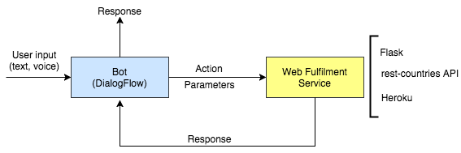

Quick and dirty simple bot created with dialogflow.

## Overview
The bot gives information about countries (capital, population, currency, region and languages), and about the weather.
We can ask the but things like:
  * What is the capital of Brazil?
  
  or
  
  * Whats the weather forecast for Berlin tomorrow?
  
  Try with yourself with this [Web demo](https://bot.dialogflow.com/721be6fe-9b42-45bc-94ca-ddcc740190e9)

## Descrition

The following picture summarizes the bot application architecture:

### Bot
* The bot was created with [Dialogflow (api.ai)](https://dialogflow.com/).
* Given a user input, dialogflow identifies which action should be performed and the values of the parameters required to perform that action.
* Ex.: User says: "What's is the capital of France?". In this case, the action to be performed is "_search country capital_", which requires parameter "_country_". The value of _country_ is "_France_" in this example.
* The action is fulfilled by a web service.

### Web Fulfillment Service
* The Web Fulfillment Service is a [Flask Application](http://flask.pocoo.org/), which was implemented as a single file (app.py).
* This aplication calls a RESTful API ([rest-countries](https://market.mashape.com/fayder/rest-countries-v1)) to get information about countries, and the [Yahoo Weather API](https://developer.yahoo.com/weather/) to get weather information.
* The application was deployed to [Heroku](https://www.heroku.com/platform).

